# 🚀 Báo Cáo Thực Hành: Kiểm Thử Tự Động Với Selenium (Automation Testing)


> **Môn học:** Kiểm thử phần mềm  
> **Nền tảng kiểm thử (Target):** [SauceDemo E-commerce](https://www.saucedemo.com/)  
> **Ngôn ngữ & Framework:** Python 3, Pytest, Selenium WebDriver  

Bài báo cáo này trình bày kết quả thực hành xây dựng **03 kịch bản kiểm thử tự động (Test Cases)** xoay quanh vòng đời mua sắm thực tế của người dùng trên website SauceDemo.

---

## 🎯 Tổng Quan Kịch Bản (Test Scenarios)

| # | Tên Test Case | Chức năng kiểm thử | Kết quả |
|---|---|---|---|
| 1 | **Login & Sort** | Đăng nhập hệ thống, thao tác lọc/sắp xếp danh sách sản phẩm. | ✅ Pass |
| 2 | **Add to Cart & Checkout** | Thêm sản phẩm vào giỏ, nhập thông tin giao hàng. | ✅ Pass |
| 3 | **Complete & Logout** | Xác nhận hóa đơn, hoàn tất thanh toán và đăng xuất an toàn. | ✅ Pass |

---

## 📸 Chi Tiết Từng Bước (Step-by-Step Execution)

### 🧪 1. Test Case 1: Đăng nhập và Sắp xếp danh sách (Login & Sort)
- **Mục tiêu:** Xác minh tính năng xác thực người dùng và khả năng tương tác với bộ lọc.
- **Tài khoản test:** `standard_user` / `secret_sauce`

<details open>
<summary><b>✨ Nhấn vào để thu gọn/mở rộng hình ảnh</b></summary>

1. **Mở trang chủ đăng nhập (Trống):**<br>
   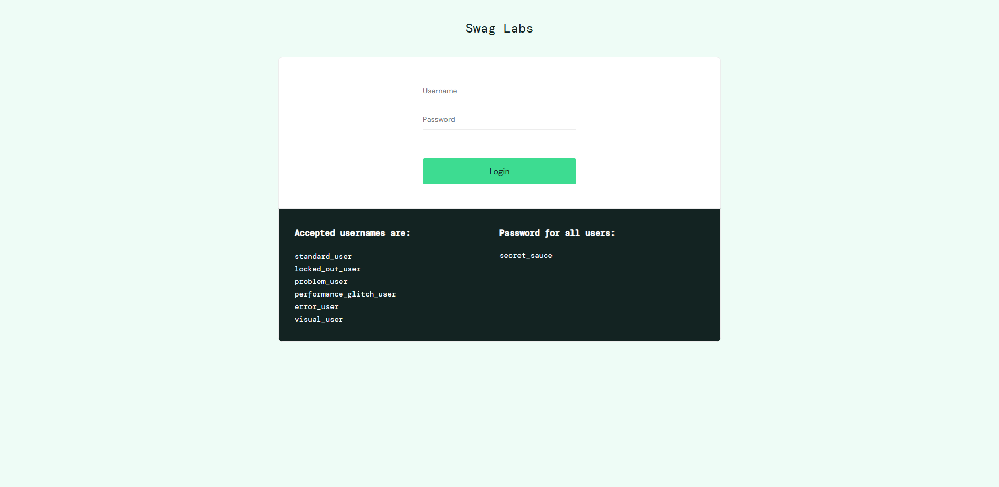

2. **Nhập thông tin đăng nhập:**<br>
   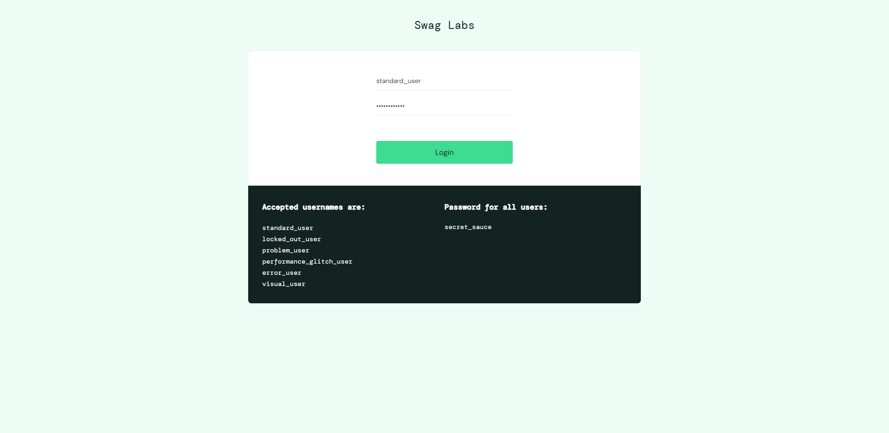

3. **Đăng nhập thành công, vào trang kho hàng (Sắp xếp mặc định A-Z):**<br>
   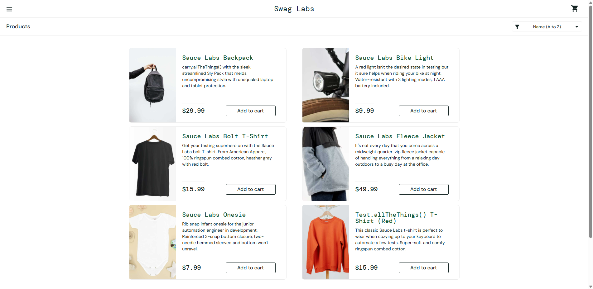

4. **Bấm chọn tính năng Filter để đổi sắp xếp sản phẩm thành từ Z-A:**<br>
   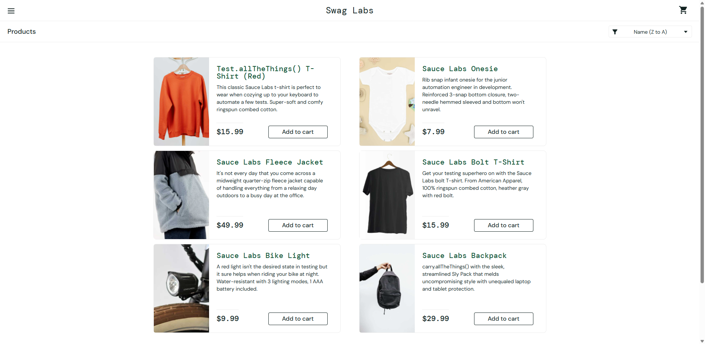

5. **Kết quả kiểm thử bằng Selenium (Terminal báo Pass):**<br>
   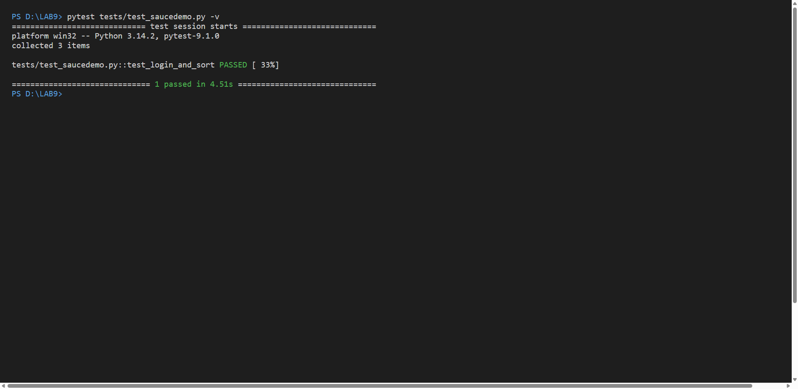
</details>

<br>

### 🛒 2. Test Case 2: Thêm giỏ hàng & Nhập thông tin (Add to Cart & Checkout)
- **Mục tiêu:** Đảm bảo luồng giỏ hàng và form nhập thông tin hoạt động trơn tru.

<details open>
<summary><b>✨ Nhấn vào để thu gọn/mở rộng hình ảnh</b></summary>

1. **Bấm Add to cart (Nút đỏ "Remove" hiện lên, Giỏ hàng có số 1):**<br>
   

2. **Bấm vào biểu tượng Giỏ hàng, mở trang "Your Cart":**<br>
   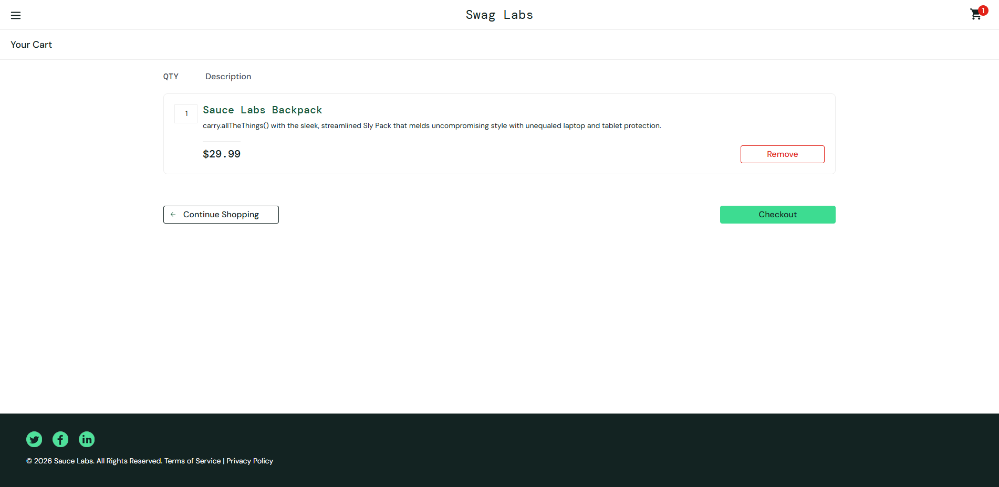

3. **Bấm Checkout, chuyển sang trang nhập thông tin:**<br>
   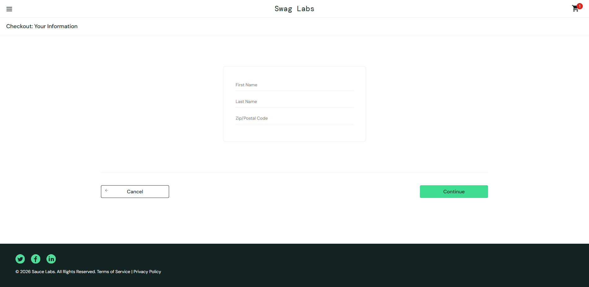

4. **Điền hoàn tất First Name, Last Name và Zip Code:**<br>
   

5. **Kết quả kiểm thử bằng Selenium (Terminal báo Pass):**<br>
   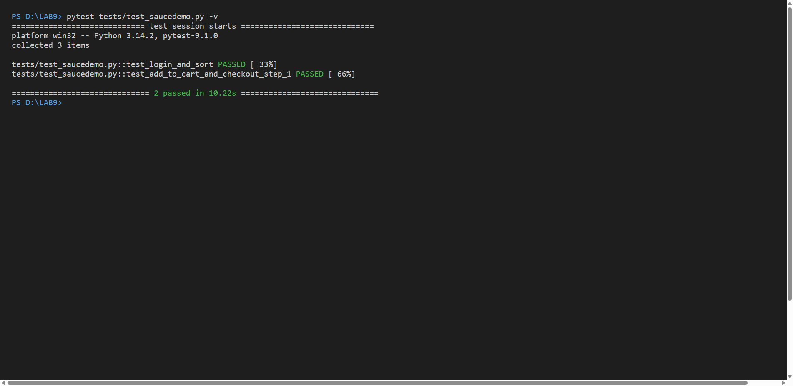
</details>

<br>

### 🏁 3. Test Case 3: Xác nhận đơn hàng & Đăng xuất (Complete & Logout)
- **Mục tiêu:** Đảm bảo thanh toán thành công và hủy phiên làm việc.

<details open>
<summary><b>✨ Nhấn vào để thu gọn/mở rộng hình ảnh</b></summary>

1. **Chuyển sang trang Checkout Overview xác nhận đơn giá cuối:**<br>
   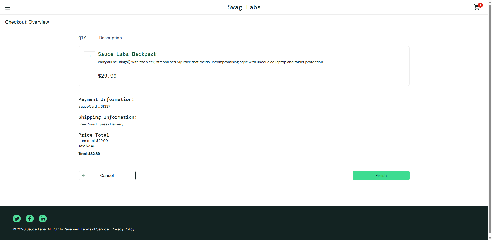

2. **Bấm Finish hoàn tất đơn hàng (Màn hình "Thank you for your order!"):**<br>
   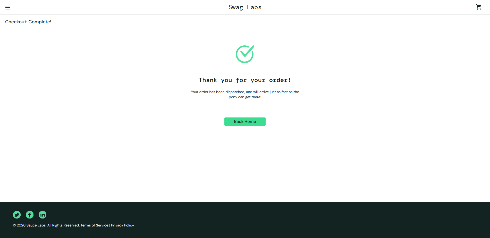

3. **Trở về danh sách sản phẩm và mở Menu Hệ thống (Sidebar trượt ra):**<br>
   

4. **Bấm Logout và thử bấm Login sai để xác nhận phiên đã đóng:**<br>
   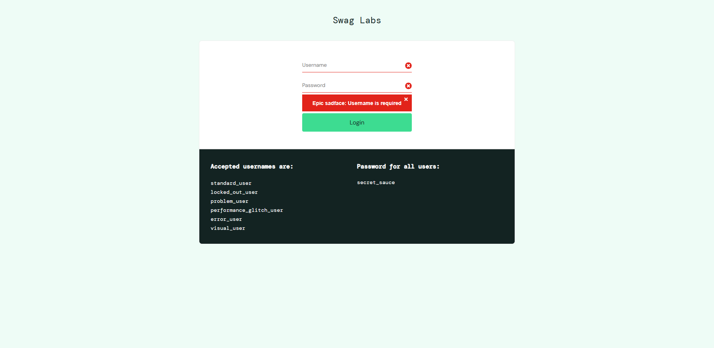

5. **Kết quả kiểm thử bằng Selenium (Terminal báo Pass cả 3):**<br>
   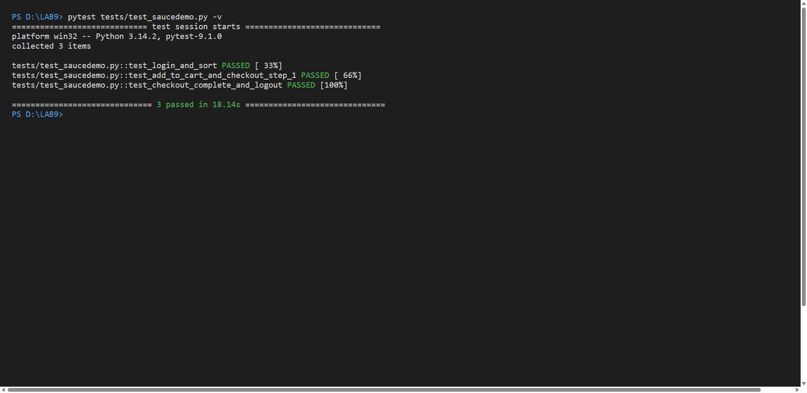
</details>

---

## 🛠️ Hướng Dẫn Cài Đặt & Chạy (How to run)

Để chạy lại toàn bộ kịch bản kiểm thử trên máy của bạn, hãy làm theo các bước sau:

1. **Clone repository về máy và cài đặt thư viện:**
```bash
pip install -r requirements.txt
```

2. **Khởi chạy kịch bản tự động:**
```bash
python -m pytest tests/test_saucedemo.py -v -s
```
> 💡 *Lưu ý: Code đã được cấu hình tự động tải Chrome Webdriver và thêm `time.sleep(1)` để giả lập thao tác của con người một cách trực quan, mượt mà nhất trên màn hình.*

---

## 💻 Mã Nguồn (Source Code)

Dưới đây là toàn bộ mã nguồn kiểm thử tự động, code đã được dọn sạch sẽ, loại bỏ các hàm chụp ảnh để tối ưu tốc độ và sự tập trung:

```python
# pyrefly: ignore [missing-import]
from selenium import webdriver
# pyrefly: ignore [missing-import]
from selenium.webdriver.common.by import By
# pyrefly: ignore [missing-import]
from selenium.webdriver.chrome.service import Service
# pyrefly: ignore [missing-import]
from webdriver_manager.chrome import ChromeDriverManager
# pyrefly: ignore [missing-import]
import pytest
import time

@pytest.fixture
def driver():
    options = webdriver.ChromeOptions()
    options.add_experimental_option("prefs", {
        "credentials_enable_service": False,
        "profile.password_manager_enabled": False
    })
    options.add_experimental_option("excludeSwitches", ["enable-automation"])
    options.add_experimental_option('useAutomationExtension', False)
    options.add_argument("--disable-features=PasswordLeakDetection")
    # Đã tắt headless để trình duyệt hiển thị lên màn hình cho sinh viên xem
    options.add_argument('--window-size=1920,1080')
    service = Service(ChromeDriverManager().install())
    driver = webdriver.Chrome(service=service, options=options)
    driver.implicitly_wait(10)
    yield driver
    driver.quit()

def test_login_and_sort(driver):
    driver.get("https://www.saucedemo.com/")
    time.sleep(1)
    
    username_input = driver.find_element(By.ID, "user-name")
    username_input.send_keys("standard_user")
    password_input = driver.find_element(By.ID, "password")
    password_input.send_keys("secret_sauce")
    time.sleep(1)
    
    driver.find_element(By.ID, "login-button").click()
    time.sleep(1)
    
    filter_dropdown = driver.find_element(By.CLASS_NAME, "product_sort_container")
    filter_dropdown.click()
    time.sleep(1)
    
    driver.find_element(By.XPATH, "//option[@value='za']").click()
    time.sleep(1)
    
    assert "inventory.html" in driver.current_url

def test_add_to_cart_and_checkout_step_1(driver):
    driver.get("https://www.saucedemo.com/")
    driver.find_element(By.ID, "user-name").send_keys("standard_user")
    driver.find_element(By.ID, "password").send_keys("secret_sauce")
    driver.find_element(By.ID, "login-button").click()
    time.sleep(1)
    
    driver.find_element(By.ID, "add-to-cart-sauce-labs-backpack").click()
    time.sleep(1)
    
    driver.find_element(By.CLASS_NAME, "shopping_cart_link").click()
    time.sleep(1)
    
    driver.find_element(By.ID, "checkout").click()
    time.sleep(1)
    
    driver.find_element(By.ID, "first-name").send_keys("John")
    driver.find_element(By.ID, "last-name").send_keys("Doe")
    driver.find_element(By.ID, "postal-code").send_keys("12345")
    time.sleep(1)
    
    assert "checkout-step-one.html" in driver.current_url

def test_checkout_complete_and_logout(driver):
    driver.get("https://www.saucedemo.com/")
    driver.find_element(By.ID, "user-name").send_keys("standard_user")
    driver.find_element(By.ID, "password").send_keys("secret_sauce")
    driver.find_element(By.ID, "login-button").click()
    driver.find_element(By.ID, "add-to-cart-sauce-labs-backpack").click()
    driver.find_element(By.CLASS_NAME, "shopping_cart_link").click()
    driver.find_element(By.ID, "checkout").click()
    driver.find_element(By.ID, "first-name").send_keys("John")
    driver.find_element(By.ID, "last-name").send_keys("Doe")
    driver.find_element(By.ID, "postal-code").send_keys("12345")
    driver.find_element(By.ID, "continue").click()
    time.sleep(1)
    
    driver.find_element(By.ID, "finish").click()
    time.sleep(1)
    
    driver.find_element(By.ID, "back-to-products").click()
    time.sleep(1)
    
    driver.find_element(By.ID, "react-burger-menu-btn").click()
    time.sleep(1)
    
    driver.find_element(By.ID, "logout_sidebar_link").click()
    time.sleep(1)
    
    assert "saucedemo.com" in driver.current_url

if __name__ == "__main__":
    pytest.main(["-v", "-s", __file__])

```
